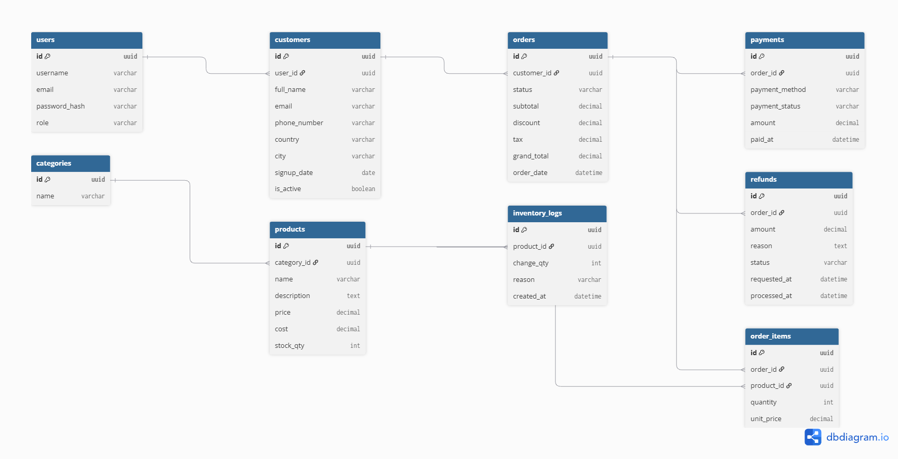
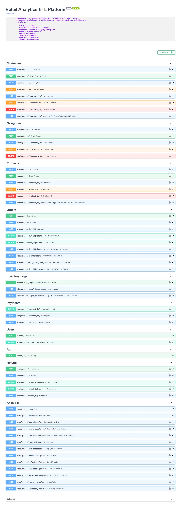
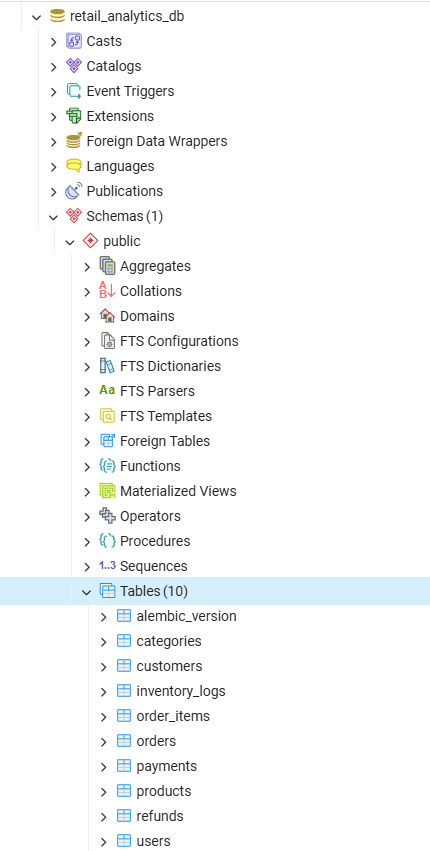
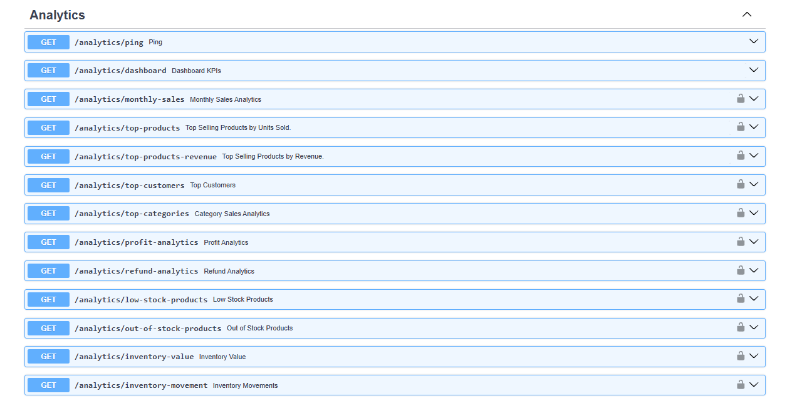
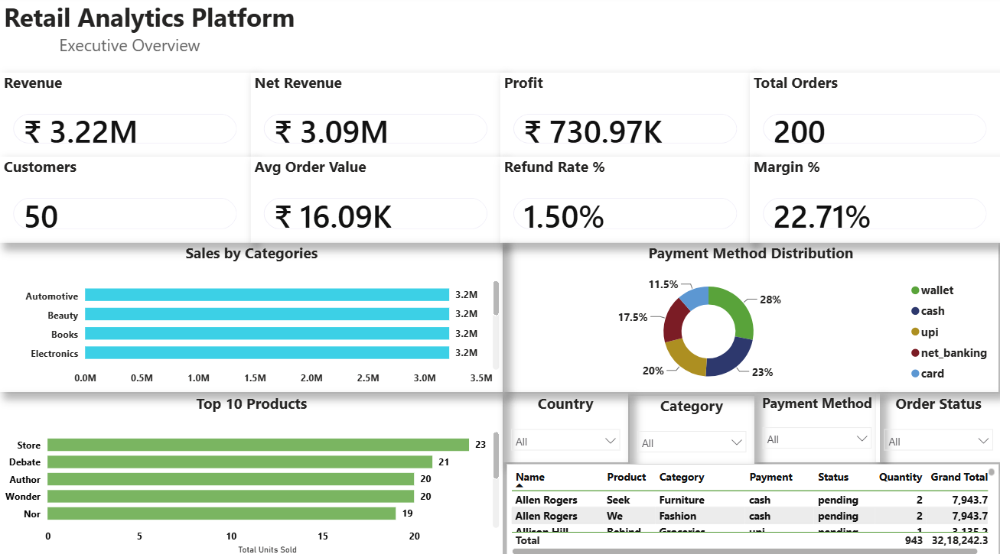
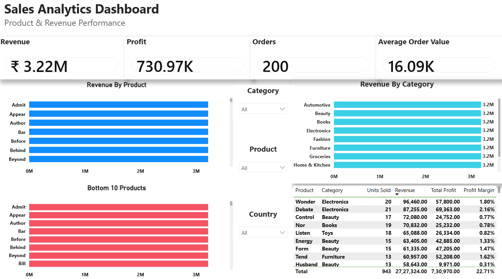
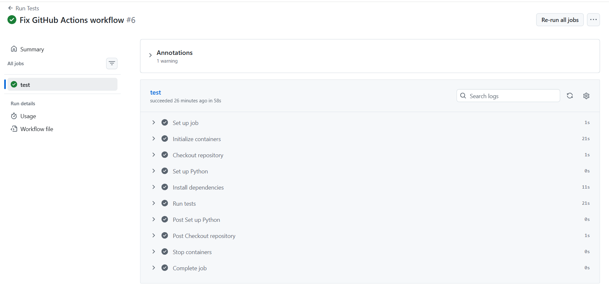

## ⭐ Project Highlights

- Developed a production-style Retail Analytics Platform using FastAPI and PostgreSQL.
- Implemented JWT Authentication and Role-Based Access Control.
- Built complete order, payment, refund, and inventory workflows.
- Created automated database seeding using Faker for realistic analytics data.
- Designed interactive Power BI dashboards with DAX measures, slicers, KPIs, and business visualizations.
- Wrote unit tests using Pytest to improve code reliability.


# 🛍️ Retail Analytics & ETL Platform

A production-style **Retail Analytics & ETL Platform** built with **FastAPI**, **PostgreSQL**, **SQLAlchemy**,**Python** and **PowerBI**.

The platform simulates the backend of a retail business by managing users, customers, products, inventory, orders, payments, refunds, and business analytics while implementing secure authentication, Role-Based Access Control (RBAC), automated testing, and Continuous Integration.

---

# 🚀 Features

## 🔐 Authentication & Authorization

- JWT Authentication
- Secure Password Hashing
- Role-Based Access Control (RBAC)
- User Registration
- Secure Login
- Admin Role Management

### Supported Roles

- Customer
- Inventory Manager
- Business Analyst
- Admin

---

## 👤 User & Customer Management

### Users

- User Registration
- Login Authentication
- Role Management
- Active User Validation

### Customers

- Create Customer Profile
- View Own Profile
- Update Own Profile
- Customer Order History
- Admin Customer Management

---

## 📦 Product & Category Management

### Categories

- Create Category
- Update Category
- Delete Category
- View Categories

### Products

- Product CRUD
- Category Mapping
- Stock Tracking
- Stock Validation
- Low Stock Monitoring

---

## 🛒 Order Management

- Create Orders
- Automatic Order Items
- Automatic Payment Creation
- Automatic Inventory Updates
- Automatic Inventory Logs
- Cancel Orders
- Inventory Restoration

### Order Workflow

```
Pending
   ↓
Paid
   ↓
Shipped
   ↓
Delivered
   ↓
Completed
```

---

## 💳 Payments

- Payment Status Workflow
- Multiple Payment Methods
- Automatic Order Status Updates
- Payment Validation

Supported Methods

- Card
- UPI
- Wallet
- Net Banking
- Cash

---

## 💰 Refund Workflow

- Customer Refund Request
- Admin Approval
- Admin Rejection
- Automatic Inventory Restoration
- Payment Refund Tracking

---

## 📋 Inventory Management

Automatic inventory logs for

- Sales
- Restocks
- Returns
- Damaged Products
- Manual Adjustments

---

# 📊 Analytics & Reporting

The platform provides business intelligence APIs for retail operations.

## Dashboard

- Total Customers
- Total Products
- Total Orders
- Completed Orders
- Refunded Orders
- Total Revenue
- Refund Amount
- Low Stock Products

---

## Sales Analytics

- Monthly Sales
- Top Selling Products
- Top Revenue Products
- Top Customers
- Top Categories

---

## Profit Analytics

- Product Profit Analysis

---

## Refund Analytics

- Total Refunds
- Refund Amount
- Refund Rate
- Average Refund Amount

---

## Inventory Analytics

- Inventory Value
- Inventory Movement
- Low Stock Products
- Out of Stock Products

---

# 🔄 ETL-Ready Architecture

The project is designed to support ETL (Extract, Transform, Load) workflows.

Current capabilities

- Structured PostgreSQL schema
- Data validation using FastAPI & Pydantic
- Business rule transformations
- Aggregated reporting APIs
- Analytics-ready database design

Future ETL enhancements

- CSV/Excel Imports
- Pandas Data Pipelines
- Scheduled ETL Jobs
- Apache Airflow Integration
- Data Warehouse Integration

---

# 🔐 Role-Based Access Control (RBAC)

| Module | Customer | Inventory Manager | Business Analyst | Admin |
|---------|:--------:|:----------------:|:----------------:|:-----:|
| Register/Login | ✅ | ✅ | ✅ | ✅ |
| Customer Profile | Own | ❌ | Read | Full |
| Products | Read | Update Stock | Read | CRUD |
| Categories | Read | Read | Read | CRUD |
| Orders | Own | Read | Read | Full |
| Payments | Own | Read | Read | Full |
| Refunds | Own | Process Returns | Read | Full |
| Inventory Logs | ❌ | CRUD | Read | Full |
| Analytics | ❌ | Inventory Only | Read All | Read All |
| User Roles | ❌ | ❌ | ❌ | Manage |

---

# 🛠 Tech Stack

## Backend

- FastAPI
- Python 3.13
- SQLAlchemy 2.0
- Alembic
- Pydantic v2
- JWT Authentication
- Passlib (Password Hashing)

---

## Database

- PostgreSQL

---

### Data Analytics

- Power BI Desktop
- DAX
- Power Query

## Authentication

- JWT Authentication
- Argon2 Password Hashing

---

## Analytics & ETL

- SQL Aggregations
- Complex Joins
- GROUP BY
- Business KPIs
- Reporting APIs
- ETL-ready Architecture

---
## Database Seeding

Populate the database with realistic demo data.

python -m scripts.seed

This generates:

- Users
- Customers
- Categories
- Products
- Orders
- Order Items
- Payments
- Inventory Logs
- Refunds

---

## Testing

- Pytest
- FastAPI TestClient
- Transaction Rollback Testing

---

### Tools

- Git
- GitHub
- VS Code
- Faker

## DevOps

- Git
- GitHub
- GitHub Actions (CI)

---

## Data Processing

- Pandas

---

# 📂 Project Structure

```text
src/
│
├── analytics/
├── auth/
├── categories/
├── common/
├── core/
├── customers/
├── db/
├── inventory_logs/
├── orderitems/
├── orders/
├── payments/
├── products/
├── refunds/
├── users/
│
└── main.py

tests/
│
├── analytics/
├── auth/
├── categories/
├── customers/
├── fixtures/
├── inventory_logs/
├── orders/
├── payments/
├── products/
├── refunds/
└── users/
```

---

# 🗄 Database Schema

The following Entity Relationship Diagram (ERD) represents the database design of the Retail Analytics & ETL Platform.

>

---

# ⚙️ Installation

Clone the repository

```bash
git clone https://github.com/Zaidu19/Retail-Analytics-ETL-Platform.git

cd Retail-Analytics-ETL-Platform
```

Create virtual environment

```bash
python -m venv env
```

Activate virtual environment

### Windows

```bash
env\Scripts\activate
```

### Linux / macOS

```bash
source env/bin/activate
```

Install dependencies

```bash
pip install -r requirements.txt
```

Run database migrations

```bash
alembic upgrade head
```

Start the server

```bash
uvicorn src.main:app --reload
```

---

# 📖 API Documentation

Swagger UI

```
http://localhost:8000/docs
```

ReDoc

```
http://localhost:8000/redoc
```

---

# 🧪 Testing

The project includes automated tests for

- Authentication
- Users
- Customers
- Categories
- Products
- Orders
- Payments
- Refunds
- Inventory Logs
- Analytics

Run tests

```bash
pytest -v
```

---
## 📊 Power BI Dashboard

The project includes an interactive Power BI dashboard built on top of the PostgreSQL database.

### Executive Dashboard

- Revenue KPIs
- Net Revenue
- Profit
- Average Order Value
- Refund Rate
- Sales by Category
- Payment Method Distribution
- Top Products
- Interactive Slicers

### Sales Analytics Dashboard

- Revenue by Product
- Revenue by Category
- Bottom Performing Products
- Product Sales Details
- Category Filters

# ⚙️ Continuous Integration

GitHub Actions automatically

- Installs dependencies
- Starts PostgreSQL
- Runs the complete Pytest suite
- Validates every push and pull request

---

# 📸 Screenshots

Include screenshots of

## Swagger API Documentation
- Swagger UI

The project exposes RESTful APIs documented using **OpenAPI (Swagger UI)** for interactive testing and exploration.




## PostgreSQL Database
- PostgreSQL Database

The project uses PostgreSQL as the primary relational database, with normalized tables and foreign key relationships supporting retail operations and analytics.



## Analytics APIs
- Analytics APIs

The platform provides business intelligence endpoints for monitoring sales performance, customer behavior, inventory, profitability, and refunds.



## 📸 Dashboard Preview

### Executive Dashboard



### Sales Analytics Dashboard




## Continuous Integration
- GitHub Actions Workflow

Every push and pull request automatically runs the complete test suite using GitHub Actions.


---

## 🔗 REST API Modules

- Authentication
- Users
- Customers
- Categories
- Products
- Orders
- Order Items
- Payments
- Refunds
- Inventory Logs
- Analytics

## 🚀 Future Improvements

- Deploy Backend on AWS
- Deploy PostgreSQL Database
- Power BI Cloud Dashboard
- Sales Forecasting
- Time Intelligence Reports
- Row-Level Security (RLS)
- CI/CD Pipeline with GitHub Actions
- Docker Support


## 💡 Skills Demonstrated

- REST API Development
- Authentication & Authorization
- Role-Based Access Control (RBAC)
- PostgreSQL Database Design
- SQLAlchemy ORM
- Alembic Migrations
- Pytest Testing
- Data Seeding with Faker
- Power BI Dashboard Development
- DAX Measures
- Data Modeling
- Git & GitHub Workflow

# 👨‍💻 Author

## Mohammad Zaid Ansari

**B.Tech – Computer Science & Engineering**

Python Backend Developer | Data Analytics Enthusiast

- GitHub: [Zaidu19](https://github.com/Zaidu19)
- LinkedIn: [Mohammad Zaid Ansari](https://www.linkedin.com/in/mohammad-zaid-ansari-607529280)


---